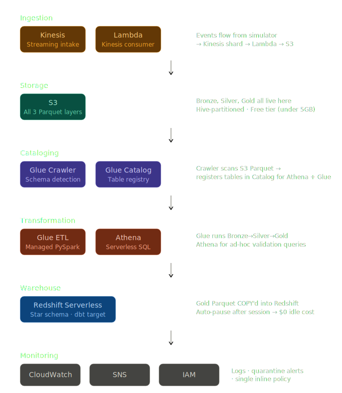

# Fitness Streaming Analytics Platform

A comparative data engineering portfolio project: **the same Bronze → Silver → Gold medallion pipeline, built three times** — once with self-managed local tooling, once with AWS managed services, and once on Databricks/Delta Lake — to demonstrate that the underlying engineering reasoning transfers across infrastructure paradigms, not just familiarity with one toolchain.

The pipeline ingests five streaming record types from wearable/fitness sources and turns them into four business-level aggregates, with the same validation rules, the same quarantine logic, and the same physiological scoring formulas implemented independently on each stack.

> **Why build it three times instead of going deep on one?** Anyone can show one pipeline on one stack. Building the same logic on three fundamentally different platforms — and being able to explain *why* each platform solves a given problem differently — is the actual skill an interview is testing for. See [`docs/decisions.md`](docs/decisions.md) for the full reasoning behind every major choice, and [`docs/interview_qa.md`](docs/interview_qa.md) for how that reasoning holds up under questioning.

---

## Architecture



**Five source record types**, ingested as streaming events:
| Record type | Description |
|---|---|
| `user_profile` | Low-frequency, CDC-style profile updates (job type, fitness goal, medical history) |
| `wearable_event` | High-frequency heart rate / activity telemetry |
| `workout_log` | Completed workout sessions |
| `sleep_log` | Nightly sleep records |
| `nutrition_snapshot` | Logged meals / nutrition entries |

**Three medallion layers**, identical in intent across all three stacks:
- **Bronze** — raw, untransformed, append-only. Exactly what arrived.
- **Silver** — validated, typed, deduplicated, one table per record type. Bad records are quarantined, never silently dropped or allowed to fail the whole batch.
- **Gold** — business-level aggregates, fully recomputed on each run:
  - **Fatigue / recovery scoring** — grounded in Foster's Session-RPE (2001), Van Dongen (2003) sleep-debt research, and Meeusen/ECSS (2013) overtraining guidelines
  - **Workout consistency**
  - **Community cohort analytics**
  - **Enriched user profiles**



---

## The three stacks

| | **Local** | **AWS** | **Databricks** |
|---|---|---|---|
| Streaming transport | Custom `StreamBus` (Kafka-equivalent abstraction — built after Docker/Kafka/Redpanda hit WSL2 incompatibilities on Windows 10) | Kinesis (1 shard) | Auto Loader (`cloudFiles`, `trigger(availableNow=True)`) |
| Ingestion compute | PySpark | Lambda (`fitness-bronze-writer`) | Databricks notebooks (Serverless) |
| Storage format | Hive-partitioned Snappy Parquet | Hive-partitioned Parquet on S3 | Delta Lake under Unity Catalog |
| Transformation | PySpark | Glue ETL jobs | Databricks notebooks (1 per record type) |
| Query/validation | DuckDB | Athena (query-only, never moves data) | Notebook SQL |
| Warehouse / serving | — | Redshift Serverless + Data API, star schema, SCD Type 2 on `dim_user` | Gold Delta tables, queried directly |
| Orchestration | Python orchestrator script | Glue job triggers | Databricks Workflows — 11-task DAG, ~5 min runtime |
| Catalog / lineage | — | Glue Data Catalog (manual lineage reconstruction) | Unity Catalog (automatic lineage — 11 upstream / 13 downstream tables, zero extra code) |

Each stack made genuinely different trade-offs given its constraints — not because one tool is "better," but because the right answer depends on what you're optimizing for (cost, operational ownership, built-in governance). The full reasoning for every choice, including what was rejected and why, is in [`docs/decisions.md`](docs/decisions.md).

---

## Repository structure

```
.
├── version_local/          # PySpark + DuckDB + StreamBus implementation
│   ├── producer/
│   ├── consumer/
│   └── etl/
├── version_aws/            # Kinesis + Lambda + Glue + Redshift implementation
│   ├── producer/
│   ├── lambda/
│   └── glue/
├── version_databricks/     # Delta Lake + Unity Catalog + Auto Loader + Workflows implementation
│   ├── producer/
│   ├── ingestion/
│   └── transform/
├── data/                   # Local Bronze/Silver/Gold/quarantine/reference sample outputs
├── docs/
│   ├── decisions.md        # Architecture decisions + rejected alternatives, by stack
│   ├── interview_qa.md     # 50+ project-specific interview Q&A
│   └── schema_reference.md # Record type schemas
├── verify_gold.py          # Cross-stack Gold table verification script
└── requirements.txt
```

---

## Current status

| Track | Status |
|---|---|
| **Local** | Phases 1–4 complete and committed. **Scope intentionally capped here** — Local was always a proof-of-logic stack, not a deployment target; see `docs/decisions.md §1.10`. |
| **AWS** | Bronze→Silver→Gold Glue jobs complete and verified. Redshift Serverless provisioned, star schema with SCD Type 2 on `dim_user` built, Gold loaded via Data API. Phase 7 (dbt on Redshift) **deliberately deferred**, sequenced after Databricks stabilization — now due. |
| **Databricks** | DB-1 through DB-5 complete and verified. All four Gold tables built; Databricks Workflows running an 11-task DAG end-to-end in ~5 minutes. DB-6–DB-8 (orchestration write-up, AWS-vs-Databricks comparison docs) in progress. |
| **Shared docs** | `decisions.md` and `interview_qa.md` drafted. README (this file) in progress. Master Word reference document — reconciling `databricks_workshop.docx` and `pipeline_reference.docx` — not yet started. |

---

## Setup

### Local
```bash
conda activate aimore        # or your environment of choice
pip install -r requirements.txt
cd version_local
python producer/run_producer.py
```

### AWS
Requires an AWS account with an IAM user scoped to Kinesis, Lambda, S3, Glue, and Redshift Serverless (least-privilege — `iam:CreateRole` intentionally withheld; see `docs/decisions.md §3.4`).
```bash
cd version_aws
python producer/run_producer.py
# Glue jobs triggered manually per session; Redshift paused after each session
```

### Databricks
Requires a Databricks workspace with Unity Catalog enabled (Free Edition / Serverless works).
1. Sync this repo to a Databricks Git folder
2. Upload the 5 reference CSVs to a Unity Catalog Volume via Catalog Explorer
3. Run the `fitness_streaming_db5_pipeline` Job (Job ID `186405698110`), or run notebooks individually top-to-bottom

---

## Key engineering principles applied throughout

- **Verify against real output before declaring anything done** — every real bug in this project (schema mismatches, a null-cohort join issue, a UI dependency misconfiguration, a duplicate producer call that would have doubled data volume per run) was caught by inspecting actual run output, never by re-reading code.
- **Bugfixes are committed separately from feature work.**
- **Logic stays identical across all three stacks** — when porting a transformation, the existing implementation is referenced, not redesigned from scratch.
- **Blast-radius isolation over DRY** — one notebook/script per record type, so a bug in one doesn't cascade into the other four.
- **Cost discipline as an operational decision** — Kinesis shards deleted after each session, Redshift Serverless paused immediately after use, Databricks ingestion batch-triggered rather than continuously streaming.

Full rationale for each of these — including what was tried and rejected — lives in [`docs/decisions.md`](docs/decisions.md).

---

## Author

Nikil — Data Analyst (Chennai) transitioning into Data Engineering. This project, alongside an earlier AWS retail sales analytics pipeline (S3/Glue/Redshift/dbt), forms the core of a comparative portfolio aimed at demonstrating platform-independent data engineering judgment.
